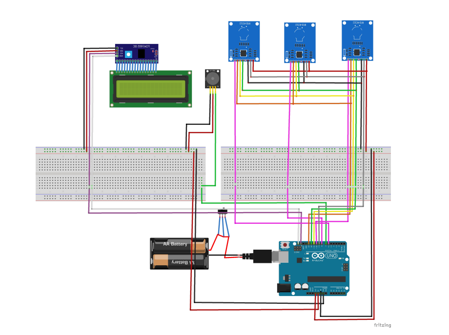
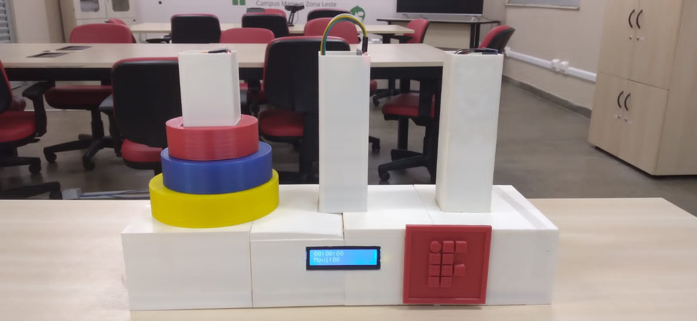
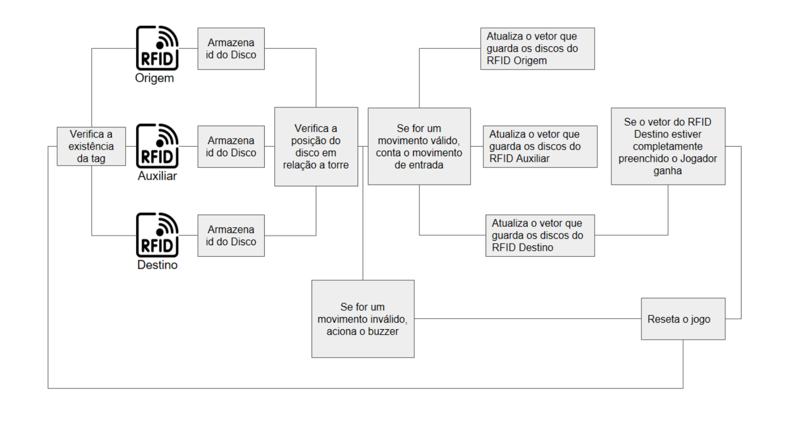

Visão Geral
-----------

Este projeto utiliza um Arduino Uno para construir uma torre de Hanoi que incorpora tecnologia RFID, módulo buzzer, chave gangorra e um display LCD.

1\. Tecnologias Utilizadas
--------------------------

1.  **Arduino Uno**: O Arduino Uno foi escolhido devido à sua facilidade de uso e versatilidade na integração com diferentes componentes. Ele atende aos requisitos de desempenho do projeto e é capaz de estabelecer conexões com diversos protocolos de comunicação.
    
2.  **RFID**: A tecnologia RFID é amplamente utilizada em diversas aplicações, desde controle de estoque até sistemas de pagamento sem contato. Neste projeto, é empregada para identificação e armazenamento de informações por meio de ondas de radiofrequência.
    
3.  **Módulo Buzzer**: O módulo buzzer é utilizado para fornecer feedback sonoro ou alertas aos usuários. Ele simplifica a geração de som em comparação com um buzzer passivo e é comumente empregado em projetos de prototipagem e eletrônica.
    
4.  **Chave Gangorra**: A chave gangorra é um interruptor elétrico comumente utilizado para controlar a passagem de corrente em um circuito. Sua operação simples e design conveniente o tornam popular em uma variedade de aplicações.
    
5.  **Display LCD e Módulo I2C**: O Display LCD é utilizado para exibir informações de texto e gráficos de forma visual. Ele fornece uma interface de usuário legível e fácil de entender. O Módulo I2C simplifica o controle do Display LCD usando o protocolo de comunicação I2C.
    

2\. Componentes Utilizados
--------------------------

*   Arduino Uno
*   Módulo RFID (MFRC522)
*   Módulo Buzzer
*   Chave Gangorra
*   Display LCD 16x2 com Módulo I2C
*   Outros componentes eletrônicos básicos (resistores, cabos jumper, etc.)

3\. Bibliotecas Utilizadas
--------------------------

O projeto faz uso das seguintes bibliotecas, que podem ser necessárias para serem instaladas no Arduino IDE:

*   `SPI.h`: Biblioteca para comunicação SPI, geralmente incluída por padrão no Arduino IDE.
*   `MFRC522.h`: Biblioteca para comunicação com o módulo RFID MFRC522.
*   `Wire.h`: Biblioteca para comunicação I2C, incluída por padrão no Arduino IDE.
*   `LiquidCrystal_I2C.h`: Biblioteca para controle do Display LCD com módulo I2C.

4\. Funcionamento
-----------------

Para integrar a tecnologia RFID ao projeto, uma abordagem criativa foi adotada: a torre e os discos foram projetados em 3D e produzidos utilizando impressão 3D. Adesivos contendo as tags RFID foram estrategicamente colocados nos discos. Esses adesivos possuem os códigos de comunicação necessários para permitir que o leitor RFID os leia corretamente.

Após carregar o código para o Arduino, a lógica implementada para a inicialização do jogo considera que os três discos estão presentes na torre origem e a retirada do disco menor da pilha inicia a cronometro, mas o primeiro movimento só é incrementado após o disco ser inserido em alguma outra torre.
O jogo termina se o jogador conseguir empilhar os discos na torre destino, ou se cometer algum erro (como por exemplo empilhar um disco maior sobre um menor, nesse caso o jogo reiniciará).

